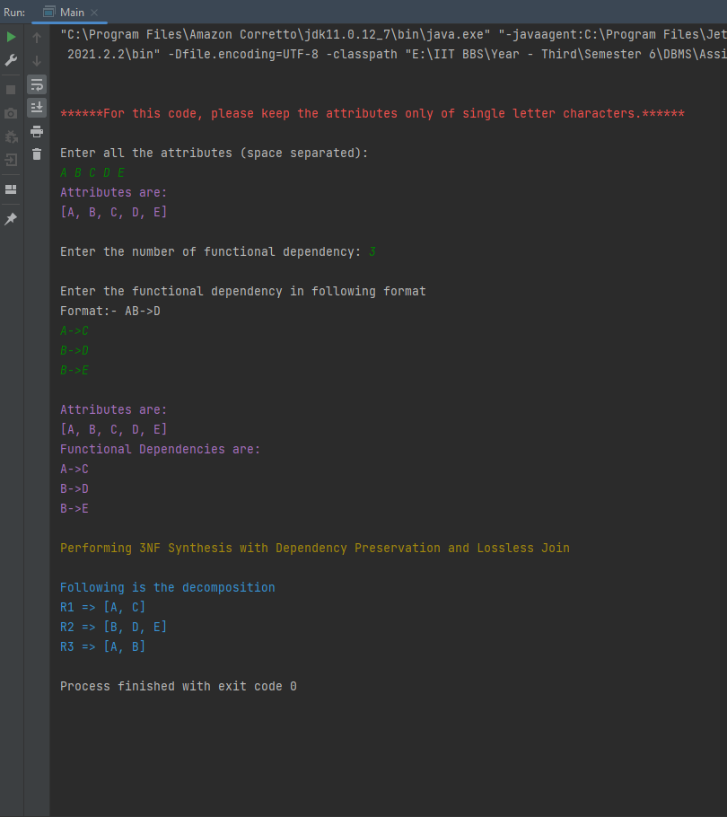
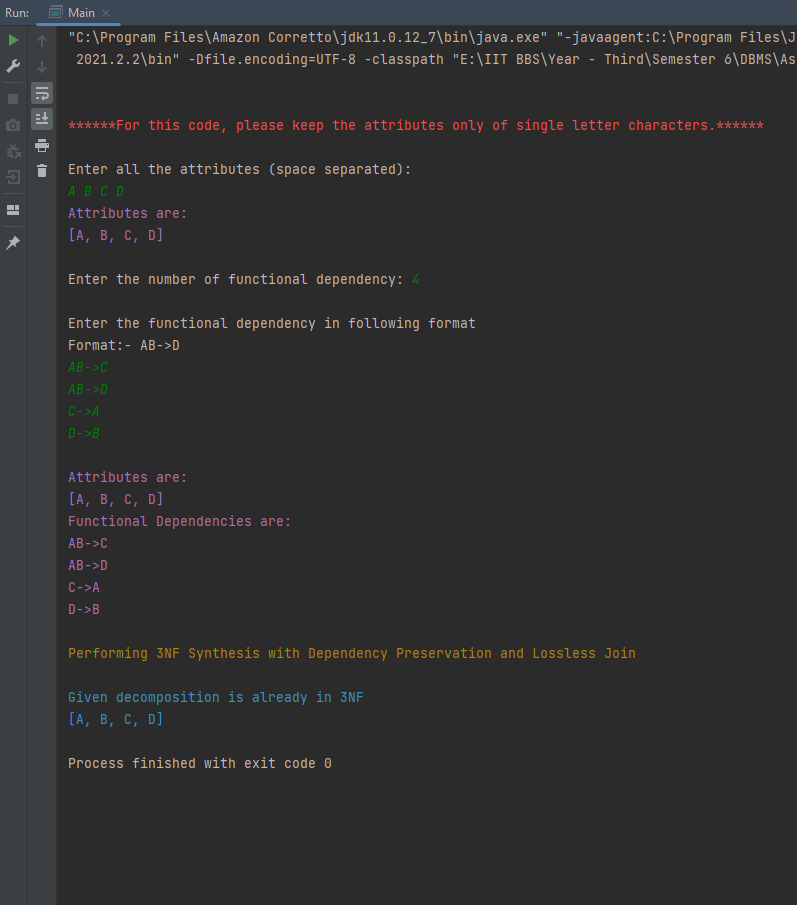
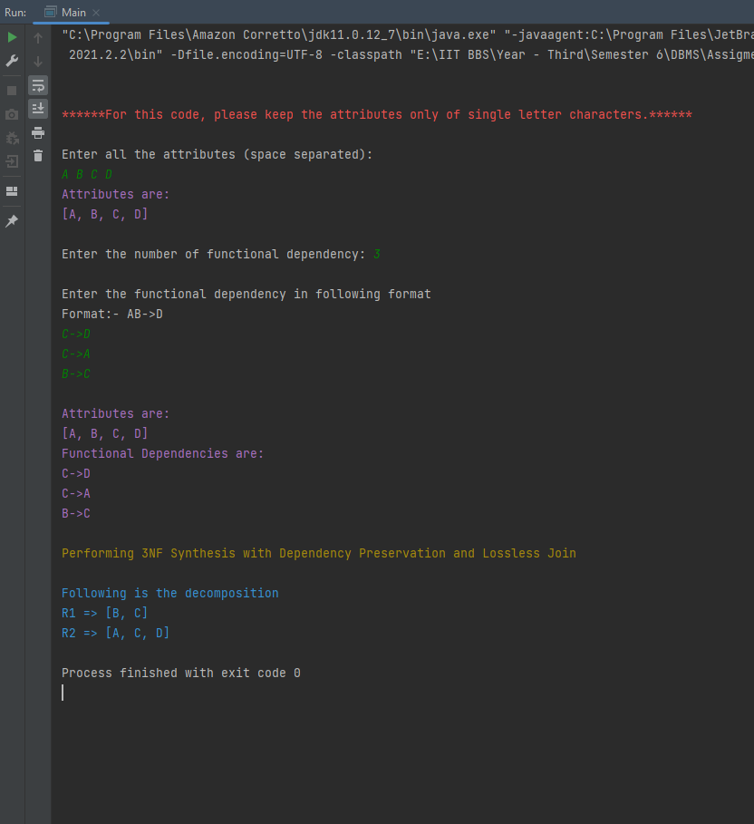

# 3NF Synthesis

----

## Algorithm:

**Input:** A universal relation R and a set of functional dependencies F on the attributes of R.

    1. Find a minimal cover G for F.
    2. For each left-hand-side X of a functional dependency that appears in G,
        Create a relation schema in D with attributes {X u {A1} u {A2} ... u {Ak}},
        where X -> A1, X -> A2,..., X -> Ak are the only depedencies in G with X as left-hand-side (X is the key of this relation).
    3. If none of the relation schemas in D contaisn a key of R, then create
        one more relation schema in D that contains attributes that form a key
        of R.

## Input format for the given code:
1. Enter all the attributes of the given relation in space a separated manner. For this code please adhere to single letter characters.
2. Enter the number of functional dependencies.
3. Enter the functional dependency in the format: AB->C, B->DEF, etc.

## Output format:
A relational decomposition showing 3NF synthesis.

## Screenshot of output:
1. Example - 1 
2. Example - 2 
3. Example - 3 